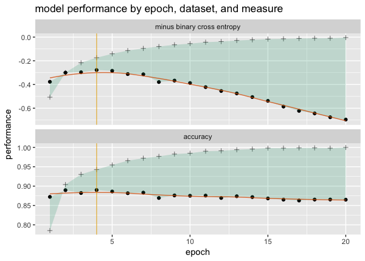

Nina Zumel had [a really great article](http://winvector.github.io/FluidData/FluidDataReshapingWithCdata.html) on how to prepare a nice [`Keras`](https://keras.io) performance plot using [`R`](https://www.r-project.org).



The issue was the data starts in the following format:


```{r}
# R code

library(wrapr)

df <- wrapr::build_frame(
  "val_loss"  , "val_acc", "loss" , "acc" , "epoch" |
    -0.377    , 0.8722   , -0.5067, 0.7852, 1       |
    -0.2997   , 0.8895   , -0.3002, 0.904 , 2       |
    -0.2964   , 0.8822   , -0.2166, 0.9303, 3       |
    -0.2779   , 0.8899   , -0.1739, 0.9428, 4       |
    -0.2843   , 0.8861   , -0.1411, 0.9545, 5       |
    -0.312    , 0.8817   , -0.1136, 0.9656, 6       )

knitr::kable(df[1, , drop = FALSE])
```

And the form that would be easiest to use with `ggplot2` would be the following:

```{r}
# R code

pf <- wrapr::build_frame(
   "epoch"  , "measure"                   , "training", "validation" |
     1      , "minus binary cross entropy", -0.5067   , -0.377       |
     1      , "accuracy"                  , 0.7852    , 0.8722       )

knitr::kable(pf)
```

In her article Nina Zumel shows a [`cdata`](https://winvector.github.io/cdata/) transform solution which we re-interpret as the following:


```{r}
# R code

library(cdata)

# define the record shape we want by example
controlTable <- wrapr::qchar_frame(
  "measure"                     , "training", "validation" |
    "minus binary cross entropy", loss      , val_loss     |
    "accuracy"                  , acc       , val_acc      )

# use our example record shape to specify the record transform
transform <- rowrecs_to_blocks_spec(
  controlTable = controlTable,
  recordKeys = 'epoch')

df %.>% transform
```

We have [a tutorial on how to design such transforms](https://cran.r-project.org/web/packages/cdata/vignettes/design.html) by writing down the shape your incoming data records are arranged in, and also the shape you wish your outgoing data records to be arranged in.

This simple data transform is in fact not a single pivot/un-pivot as the result records spread data-values over multiple rows and multiple columns at the same time. We call the transform simple, because from a user point of view: it takes records of one form to another form (with the details left to the implementation).

What I would like to comment on here is: some of the great advantages in using a data driven record transform specification.

First, as we see above and in the [tutorial](https://cran.r-project.org/web/packages/cdata/vignettes/design.html), once learned the specification system is very easy (and powerful).

Next: we can print the transformation and check if it matches our intent:

```{r}
# R code

print(transform)
```

The important point is: the transform is specified in data (not code):

```{r}
# R code

str(transform)
```


Because the transform is data (not code), it is easy to share with other systems: such as [`SQL`](https://en.wikipedia.org/wiki/SQL) or [`Python`](https://www.python.org)/[`Pandas`](https://pandas.pydata.org).

To show this we will first convert the transform specification into [`YAML`](https://yaml.org) for transport.

```{r}
# R code

library(yaml)

yaml_str <- transform %.>%
  convert_cdata_spec_to_yaml(.) %.>%
  yaml::as.yaml(.)

cat(yaml_str)
```

We can then import this structure into `Python`.

```{r}
# R code

library(reticulate)
use_condaenv("aiAcademy") 
```

The transported operator can then be used in Python.

```{python}
# Python code

import yaml
import pandas
import data_algebra
from data_algebra.cdata_impl import record_map_from_simple_obj

transform = record_map_from_simple_obj(yaml.safe_load(r.yaml_str))

print(transform)
```


```{python}
# Python code

print(r.df)
```

```{python}
# Python code

res = r.df >> transform

print(res)
```


And even converted to `SQL` (either in `R` directly or in `Python` directly).

```{python}
# Python code

from data_algebra.SQLite import SQLiteModel
from data_algebra.data_ops import *

db_model = SQLiteModel()
ops = TableDescription('keras_frame', ["val_loss"  , "val_acc", "loss" , "acc" , "epoch"]). \
  convert_records(transform)\

sql_str = ops.to_sql(db_model, pretty=True)
print(sql_str)
```


More on cross-language data processing can be found [here](https://github.com/WinVector/rquery/blob/master/Examples/data_algebra/interop.md), [here](https://github.com/WinVector/data_algebra/blob/master/Examples/LogisticExample/ScoringExample.md),
and [here](https://github.com/WinVector/data_algebra/blob/master/Examples/cdata/cdata_example.ipynb).


