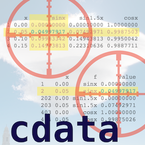

---
output:
  md_document:
    variant: markdown_github
---

<!-- README.md is generated from README.Rmd. Please edit that file -->

`cdata` is an explanation of "coordinatized data" and includes deliberately verbose wrappers for `tidyr::gather()` and `tidyr::spread()`.  Useful for training and for checking extra invariants.



Install via CRAN:

```{r, eval=FALSE}
install.packages("cdata")
```

Or from Github using devtools:

```{r, eval=FALSE}
devtools::install_github("WinVector/cdata")
```

For use please try:

```{r, eval=FALSE}
vignette('RowsAndColumns', package = 'cdata')
```
