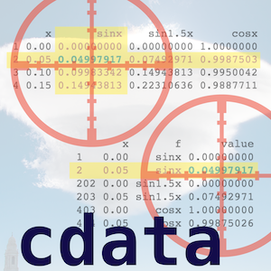

<!-- README.md is generated from README.Rmd. Please edit that file -->

`cdata` is a running explanation of the ["coordinatized data" theory](https://github.com/WinVector/cdata/blob/master/extras/RowsAndColumns.md) and includes an implementation of the ["fluid data" methodology](https://github.com/WinVector/cdata/blob/master/extras/FluidData.md).



Install via CRAN:

```{r, eval=FALSE}
install.packages("cdata")
```

Or from Github using devtools:

```{r, eval=FALSE}
devtools::install_github("WinVector/cdata")
```

