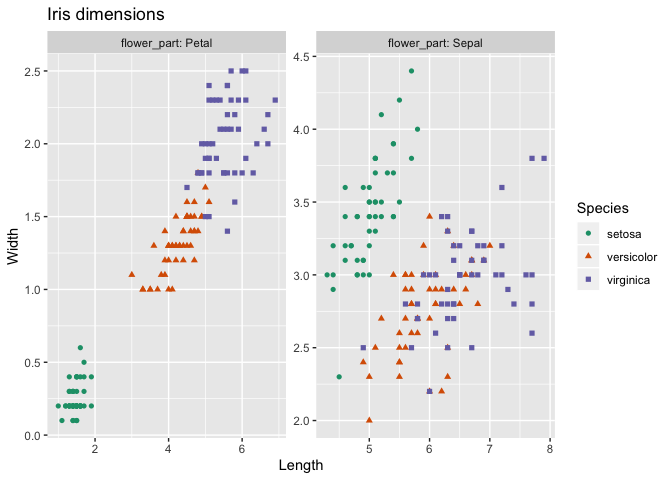

<!-- README.md is generated from README.Rmd. Please edit that file -->
[`cdata`](https://CRAN.R-project.org/package=cdata) is a general data re-shaper that has the great virtue of adhering to Raymond's "Rule of Representation", and using Codd's "Guaranteed Access Rule".

> Fold knowledge into data, so program logic can be stupid and robust.
>
> [*The Art of Unix Programming*, Erick S. Raymond, Addison-Wesley, 2003](http://www.catb.org/esr/writings/taoup/html/ch01s06.html#id2878263)

> Rule 2: The guaranteed access rule.
>
> Each and every datum (atomic value) in a relational data base is guaranteed to be logically accessible by resorting to a combination of table name, primary key value and column name.
>
> [Edgar F. Codd](https://en.wikipedia.org/wiki/Codd%27s_12_rules)

The point being: it is much easier to reason about data than to try to reason about code, so using data to control your code is often a very good trade-off.


Briefly: `cdata` supplies data transform operators that:

-   Work on local data or with any `DBI` data source.
-   Are powerful generalizations of the operations commonly called `pivot` and `un-pivot`.
-   Allow for example-driven graphical specification of data transforms or data layout control.
-   Work in-memory or with `SQL` databases.

A quick example: plot iris petal and sepal dimensions in a faceted graph.

``` r
iris <- data.frame(iris)
iris$iris_id <- seq_len(nrow(iris))

# show the data
head(iris)
 #    Sepal.Length Sepal.Width Petal.Length Petal.Width Species iris_id
 #  1          5.1         3.5          1.4         0.2  setosa       1
 #  2          4.9         3.0          1.4         0.2  setosa       2
 #  3          4.7         3.2          1.3         0.2  setosa       3
 #  4          4.6         3.1          1.5         0.2  setosa       4
 #  5          5.0         3.6          1.4         0.2  setosa       5
 #  6          5.4         3.9          1.7         0.4  setosa       6

library("ggplot2")
 #  Warning: package 'ggplot2' was built under R version 3.5.2
library("cdata")

#
# build a control table with a "key column" flower_part
# and "value columns" Length and Width
#
controlTable <- wrapr::qchar_frame(
  "flower_part", "Length"     , "Width"     |
    "Petal"    , Petal.Length , Petal.Width |
    "Sepal"    , Sepal.Length , Sepal.Width )

transform <- rowrecs_to_blocks_spec(
  controlTable,
  recordKeys = c("iris_id", "Species"))

# do the unpivot to convert the row records to block records
iris_aug <- iris %.>% transform

# show the tranformed data
head(iris_aug)
 #    iris_id Species flower_part Length Width
 #  1       1  setosa       Petal    1.4   0.2
 #  2       1  setosa       Sepal    5.1   3.5
 #  3       2  setosa       Petal    1.4   0.2
 #  4       2  setosa       Sepal    4.9   3.0
 #  5       3  setosa       Petal    1.3   0.2
 #  6       3  setosa       Sepal    4.7   3.2

# plot the graph
ggplot(iris_aug, aes(x=Length, y=Width)) +
  geom_point(aes(color=Species, shape=Species)) + 
  facet_wrap(~flower_part, labeller = label_both, scale = "free") +
  ggtitle("Iris dimensions") +  scale_color_brewer(palette = "Dark2")
```



``` r

# show the transform
print(transform)
 #  {
 #   row_record <- wrapr::qchar_frame(
 #     "iris_id"  , "Species", "Petal.Length", "Sepal.Length", "Petal.Width", "Sepal.Width" |
 #       .        , .        , Petal.Length  , Sepal.Length  , Petal.Width  , Sepal.Width   )
 #   row_keys <- c('iris_id', 'Species')
 #  
 #   # becomes
 #  
 #   block_record <- wrapr::qchar_frame(
 #     "iris_id"  , "Species", "flower_part", "Length"    , "Width"     |
 #       .        , .        , "Petal"      , Petal.Length, Petal.Width |
 #       .        , .        , "Sepal"      , Sepal.Length, Sepal.Width )
 #   block_keys <- c('iris_id', 'Species', 'flower_part')
 #  
 #   # args: c(checkNames = TRUE, checkKeys = FALSE, strict = FALSE, allow_rqdatatable = TRUE)
 #  }

# show the representation of the transform
unclass(transform)
 #  $controlTable
 #    flower_part       Length       Width
 #  1       Petal Petal.Length Petal.Width
 #  2       Sepal Sepal.Length Sepal.Width
 #  
 #  $recordKeys
 #  [1] "iris_id" "Species"
 #  
 #  $controlTableKeys
 #  [1] "flower_part"
 #  
 #  $checkNames
 #  [1] TRUE
 #  
 #  $checkKeys
 #  [1] FALSE
 #  
 #  $strict
 #  [1] FALSE
 #  
 #  $allow_rqdatatable
 #  [1] TRUE
```

More details on the above example can be found [here](http://www.win-vector.com/blog/2018/10/faceted-graphs-with-cdata-and-ggplot2/). A tutorial on how to design a `controlTable` can be found [here](https://winvector.github.io/cdata/articles/design.html). And some discussion of the nature of records in `cdata` can be found [here](https://winvector.github.io/cdata/articles/blocksrecs.html).

------------------------------------------------------------------------

We can also exhibit a larger example of using `cdata` to create a scatter-plot matrix, or pair plot:

``` r

iris <- data.frame(iris)
iris$iris_id <- seq_len(nrow(iris))

library("ggplot2")
library("cdata")

# declare our columns of interest
meas_vars <- qc(Sepal.Length, Sepal.Width, Petal.Length, Petal.Width)
category_variable <- "Species"

# build a control with all pairs of variables as value columns
# and pair_key as the key column
controlTable <- data.frame(expand.grid(meas_vars, meas_vars, 
                                       stringsAsFactors = FALSE))
# one copy of columns is coordinate names second copy is values
controlTable <- cbind(controlTable, controlTable)
# name the value columns value1 and value2
colnames(controlTable) <- qc(v1, v2, value1, value2)
transform <- rowrecs_to_blocks_spec(
  controlTable,
  recordKeys = c("iris_id", "Species"),
  controlTableKeys = qc(v1, v2),
  checkKeys = FALSE)

# do the unpivot to convert the row records to multiple block records
iris_aug <- iris %.>% transform
# alternate notation: layout_by(transform, iris)


ggplot(iris_aug, aes(x=value1, y=value2)) +
  geom_point(aes_string(color=category_variable, shape=category_variable)) + 
  facet_grid(v2~v1, labeller = label_both, scale = "free") +
  ggtitle("Iris dimensions") +
  scale_color_brewer(palette = "Dark2") +
  ylab(NULL) + 
  xlab(NULL)
```


``` r

# show transform
print(transform)
 #  {
 #   row_record <- wrapr::qchar_frame(
 #     "iris_id"  , "Species", "Sepal.Length", "Sepal.Width", "Petal.Length", "Petal.Width" |
 #       .        , .        , Sepal.Length  , Sepal.Width  , Petal.Length  , Petal.Width   )
 #   row_keys <- c('iris_id', 'Species')
 #  
 #   # becomes
 #  
 #   block_record <- wrapr::qchar_frame(
 #     "iris_id"  , "Species", "v1"          , "v2"          , "value1"    , "value2"     |
 #       .        , .        , "Sepal.Length", "Sepal.Length", Sepal.Length, Sepal.Length |
 #       .        , .        , "Sepal.Width" , "Sepal.Length", Sepal.Width , Sepal.Length |
 #       .        , .        , "Petal.Length", "Sepal.Length", Petal.Length, Sepal.Length |
 #       .        , .        , "Petal.Width" , "Sepal.Length", Petal.Width , Sepal.Length |
 #       .        , .        , "Sepal.Length", "Sepal.Width" , Sepal.Length, Sepal.Width  |
 #       .        , .        , "Sepal.Width" , "Sepal.Width" , Sepal.Width , Sepal.Width  |
 #       .        , .        , "Petal.Length", "Sepal.Width" , Petal.Length, Sepal.Width  |
 #       .        , .        , "Petal.Width" , "Sepal.Width" , Petal.Width , Sepal.Width  |
 #       .        , .        , "Sepal.Length", "Petal.Length", Sepal.Length, Petal.Length |
 #       .        , .        , "Sepal.Width" , "Petal.Length", Sepal.Width , Petal.Length |
 #       .        , .        , "Petal.Length", "Petal.Length", Petal.Length, Petal.Length |
 #       .        , .        , "Petal.Width" , "Petal.Length", Petal.Width , Petal.Length |
 #       .        , .        , "Sepal.Length", "Petal.Width" , Sepal.Length, Petal.Width  |
 #       .        , .        , "Sepal.Width" , "Petal.Width" , Sepal.Width , Petal.Width  |
 #       .        , .        , "Petal.Length", "Petal.Width" , Petal.Length, Petal.Width  |
 #       .        , .        , "Petal.Width" , "Petal.Width" , Petal.Width , Petal.Width  )
 #   block_keys <- c('iris_id', 'Species', 'v1', 'v2')
 #  
 #   # args: c(checkNames = TRUE, checkKeys = FALSE, strict = FALSE, allow_rqdatatable = TRUE)
 #  }
```

The above is now wrapped into a [one-line command in `WVPlots`](https://winvector.github.io/WVPlots/reference/PairPlot.html).

------------------------------------------------------------------------

The `cdata` package develops the idea of the ["coordinatized data" theory](http://winvector.github.io/FluidData/RowsAndColumns.html) and includes an implementation of the ["fluid data" methodology](http://winvector.github.io/FluidData/FluidData.html).

The main `cdata` interfaces are given by the following set of methods:

-   [`rowrecs_to_blocks_spec()`](https://winvector.github.io/cdata/reference/rowrecs_to_blocks_spec.html), for specifying how single row records map to general multi-row (or block) records.
-   [`blocks_to_rowrecs_spec()`](https://winvector.github.io/cdata/reference/blocks_to_rowrecs_spec.html), for specifying how multi-row block records map to single-row records.
-   [`layout_specification()`](https://winvector.github.io/cdata/reference/layout_specification.html), for specifying transforms from multi-row records to other multi-row records.
-   [`layout_by()`](https://winvector.github.io/cdata/reference/layout_by.html) or the [wrapr dot arrow pipe](https://winvector.github.io/wrapr/reference/dot_arrow.html) for applying a layout to re-arrange data.
-   `t()` (transpose/adjoint) to invert or reverse layout specifications.

Some convenience functions include:

-   [`pivot_to_rowrecs()`](https://winvector.github.io/cdata/reference/pivot_to_rowrecs.html), for moving data from multi-row block records with one value per row (a single column of values) to single-row records \[`spread` or `dcast`\].
-   [`pivot_to_blocks()`/`unpivot_to_blocks()`](https://winvector.github.io/cdata/reference/unpivot_to_blocks.html), for moving data from single-row records to possibly multi row block records with one row per value (a single column of values) \[`gather` or `melt`\].
-   [`wrapr::qchar_frame()`](https://winvector.github.io/wrapr/reference/qchar_frame.html) a helper function for specifying record control table layout specifications.
-   [`wrapr::build_frame()`](https://winvector.github.io/wrapr/reference/build_frame.html) a helper function for specifying data frames.

The package vignettes can be found in the "Articles" tab of [the `cdata` documentation site](https://winvector.github.io/cdata/).

The (older) recommended tutorial is: [Fluid data reshaping with cdata](http://winvector.github.io/FluidData/FluidDataReshapingWithCdata.html). We also have a (older) [short free cdata screencast](https://youtu.be/4cYbP3kbc0k) (and another example can be found [here](http://winvector.github.io/FluidData/DataWranglingAtScale.html)). These concepts were later adapted from `cdata` by the `tidyr` package.

------------------------------------------------------------------------

Install via CRAN:

``` r
install.packages("cdata")
```

------------------------------------------------------------------------

Note: `cdata` is targeted at data with "tame column names" (column names that are valid both in databases, and as `R` unquoted variable names) and basic types (column values that are simple `R` types such as `character`, `numeric`, `logical`, and so on).
