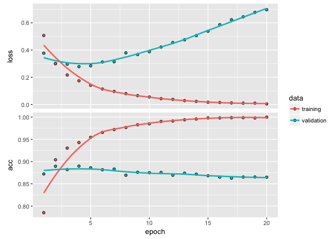
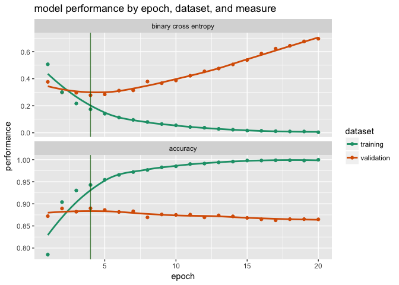
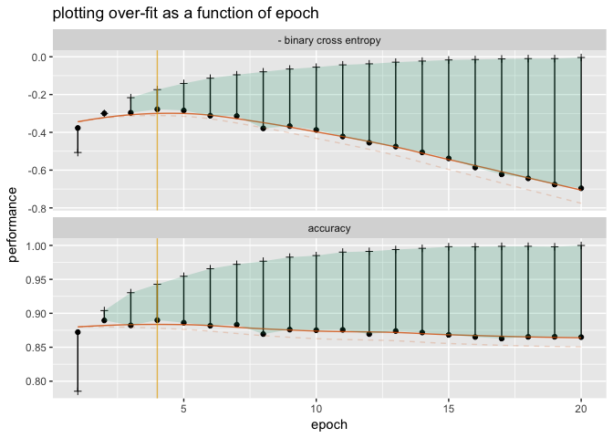

PlotExample
================
Win-Vector LLC
12/21/2017

``` r
library("ggplot2")
library("cdata")
```

    ## Loading required package: wrapr

``` r
library("seplyr")
library("keras")
```

    ## Warning: package 'keras' was built under R version 3.4.3

``` r
library("kableExtra")
options(knitr.table.format = "html") 

h <- readRDS("historyobject.rds")
plot(h)
```



``` r
d <- readRDS("metricsframe.rds")
d$epoch <- seq_len(nrow(d))
d$loss <- -d$loss
d$val_loss <- -d$val_loss
knitr::kable(head(d))
```

<table>
<thead>
<tr>
<th style="text-align:right;">
val\_loss
</th>
<th style="text-align:right;">
val\_acc
</th>
<th style="text-align:right;">
loss
</th>
<th style="text-align:right;">
acc
</th>
<th style="text-align:right;">
epoch
</th>
</tr>
</thead>
<tbody>
<tr>
<td style="text-align:right;">
-0.3769818
</td>
<td style="text-align:right;">
0.8722
</td>
<td style="text-align:right;">
-0.5067290
</td>
<td style="text-align:right;">
0.7852000
</td>
<td style="text-align:right;">
1
</td>
</tr>
<tr>
<td style="text-align:right;">
-0.2996994
</td>
<td style="text-align:right;">
0.8895
</td>
<td style="text-align:right;">
-0.3002033
</td>
<td style="text-align:right;">
0.9040000
</td>
<td style="text-align:right;">
2
</td>
</tr>
<tr>
<td style="text-align:right;">
-0.2963943
</td>
<td style="text-align:right;">
0.8822
</td>
<td style="text-align:right;">
-0.2165675
</td>
<td style="text-align:right;">
0.9303333
</td>
<td style="text-align:right;">
3
</td>
</tr>
<tr>
<td style="text-align:right;">
-0.2779052
</td>
<td style="text-align:right;">
0.8899
</td>
<td style="text-align:right;">
-0.1738829
</td>
<td style="text-align:right;">
0.9428000
</td>
<td style="text-align:right;">
4
</td>
</tr>
<tr>
<td style="text-align:right;">
-0.2842501
</td>
<td style="text-align:right;">
0.8861
</td>
<td style="text-align:right;">
-0.1410933
</td>
<td style="text-align:right;">
0.9545333
</td>
<td style="text-align:right;">
5
</td>
</tr>
<tr>
<td style="text-align:right;">
-0.3119754
</td>
<td style="text-align:right;">
0.8817
</td>
<td style="text-align:right;">
-0.1135626
</td>
<td style="text-align:right;">
0.9656000
</td>
<td style="text-align:right;">
6
</td>
</tr>
</tbody>
</table>
``` r
cT <- buildUnPivotControlTable(
  nameForNewKeyColumn= 'origColName',
  nameForNewValueColumn= 'performance',
  columnsToTakeFrom= c('val_loss',
                       'val_acc',
                       'loss',
                       'acc' ))
dT <- moveValuesToRowsD(
  d,
  controlTable = cT,
  columnsToCopy = "epoch")
knitr::kable(head(dT))
```

<table>
<thead>
<tr>
<th style="text-align:right;">
epoch
</th>
<th style="text-align:left;">
origColName
</th>
<th style="text-align:right;">
performance
</th>
</tr>
</thead>
<tbody>
<tr>
<td style="text-align:right;">
1
</td>
<td style="text-align:left;">
val\_loss
</td>
<td style="text-align:right;">
-0.3769818
</td>
</tr>
<tr>
<td style="text-align:right;">
1
</td>
<td style="text-align:left;">
val\_acc
</td>
<td style="text-align:right;">
0.8722000
</td>
</tr>
<tr>
<td style="text-align:right;">
1
</td>
<td style="text-align:left;">
loss
</td>
<td style="text-align:right;">
-0.5067290
</td>
</tr>
<tr>
<td style="text-align:right;">
1
</td>
<td style="text-align:left;">
acc
</td>
<td style="text-align:right;">
0.7852000
</td>
</tr>
<tr>
<td style="text-align:right;">
2
</td>
<td style="text-align:left;">
val\_loss
</td>
<td style="text-align:right;">
-0.2996994
</td>
</tr>
<tr>
<td style="text-align:right;">
2
</td>
<td style="text-align:left;">
val\_acc
</td>
<td style="text-align:right;">
0.8895000
</td>
</tr>
</tbody>
</table>
``` r
mp <- data.frame(
  origColName = qc(val_loss, val_acc, 
                     loss, acc),
  dataset = qc("validation", "validation", 
               "training", "training"),
  measure = qc("- binary cross entropy", "accuracy",
               "- binary cross entropy", "accuracy"),
  stringsAsFactors = FALSE)
knitr::kable(mp)
```

<table>
<thead>
<tr>
<th style="text-align:left;">
origColName
</th>
<th style="text-align:left;">
dataset
</th>
<th style="text-align:left;">
measure
</th>
</tr>
</thead>
<tbody>
<tr>
<td style="text-align:left;">
val\_loss
</td>
<td style="text-align:left;">
validation
</td>
<td style="text-align:left;">
-   binary cross entropy
    </td>
    </tr>
    <tr>
    <td style="text-align:left;">
    val\_acc
    </td>
    <td style="text-align:left;">
    validation
    </td>
    <td style="text-align:left;">
    accuracy
    </td>
    </tr>
    <tr>
    <td style="text-align:left;">
    loss
    </td>
    <td style="text-align:left;">
    training
    </td>
    <td style="text-align:left;">
    -   binary cross entropy
        </td>
        </tr>
        <tr>
        <td style="text-align:left;">
        acc
        </td>
        <td style="text-align:left;">
        training
        </td>
        <td style="text-align:left;">
        accuracy
        </td>
        </tr>
        </tbody>
        </table>

``` r
dT <- map_fieldsD(dT, 
                  "origColName",
                  mp)
dT$measure <- factor(dT$measure, 
                     levels = c("- binary cross entropy",
                                "accuracy"))
knitr::kable(head(dT))
```

<table>
<thead>
<tr>
<th style="text-align:right;">
epoch
</th>
<th style="text-align:left;">
origColName
</th>
<th style="text-align:right;">
performance
</th>
<th style="text-align:left;">
dataset
</th>
<th style="text-align:left;">
measure
</th>
</tr>
</thead>
<tbody>
<tr>
<td style="text-align:right;">
1
</td>
<td style="text-align:left;">
val\_loss
</td>
<td style="text-align:right;">
-0.3769818
</td>
<td style="text-align:left;">
validation
</td>
<td style="text-align:left;">
-   binary cross entropy
    </td>
    </tr>
    <tr>
    <td style="text-align:right;">
    1
    </td>
    <td style="text-align:left;">
    val\_acc
    </td>
    <td style="text-align:right;">
    0.8722000
    </td>
    <td style="text-align:left;">
    validation
    </td>
    <td style="text-align:left;">
    accuracy
    </td>
    </tr>
    <tr>
    <td style="text-align:right;">
    1
    </td>
    <td style="text-align:left;">
    loss
    </td>
    <td style="text-align:right;">
    -0.5067290
    </td>
    <td style="text-align:left;">
    training
    </td>
    <td style="text-align:left;">
    -   binary cross entropy
        </td>
        </tr>
        <tr>
        <td style="text-align:right;">
        1
        </td>
        <td style="text-align:left;">
        acc
        </td>
        <td style="text-align:right;">
        0.7852000
        </td>
        <td style="text-align:left;">
        training
        </td>
        <td style="text-align:left;">
        accuracy
        </td>
        </tr>
        <tr>
        <td style="text-align:right;">
        2
        </td>
        <td style="text-align:left;">
        val\_loss
        </td>
        <td style="text-align:right;">
        -0.2996994
        </td>
        <td style="text-align:left;">
        validation
        </td>
        <td style="text-align:left;">
        -   binary cross entropy
            </td>
            </tr>
            <tr>
            <td style="text-align:right;">
            2
            </td>
            <td style="text-align:left;">
            val\_acc
            </td>
            <td style="text-align:right;">
            0.8895000
            </td>
            <td style="text-align:left;">
            validation
            </td>
            <td style="text-align:left;">
            accuracy
            </td>
            </tr>
            </tbody>
            </table>

``` r
pick <- dT %.>%
  filter_se(.,
            qe(measure == "- binary cross entropy",
               dataset == "validation")) %.>%
  .$epoch[[which.max(.$performance)]]

ggplot(data = dT, 
       aes(x = epoch, 
           y = performance,
           color = dataset)) +
  geom_point() +
  stat_smooth(geom = "line", se = FALSE, method = "loess", alpha = 0.5) +
  facet_wrap(~measure, ncol=1, scales = "free_y") +
  geom_vline(xintercept = pick, alpha=0.7, color='darkgreen') +
  scale_color_brewer(palette = "Dark2") + 
  ggtitle("model performance by epoch, dataset, and measure")
```



``` r
d %.>%
  head(., n=1) %.>%
  select_se(., qc(val_loss, val_acc, loss, acc)) %.>%
  knitr::kable(.)  %.>%
  kable_styling(., full_width = F) %.>%
  column_spec(., 1:4, background = "yellow")
```

<table class="table" style="width: auto !important; margin-left: auto; margin-right: auto;">
<thead>
<tr>
<th style="text-align:right;">
val\_loss
</th>
<th style="text-align:right;">
val\_acc
</th>
<th style="text-align:right;">
loss
</th>
<th style="text-align:right;">
acc
</th>
</tr>
</thead>
<tbody>
<tr>
<td style="text-align:right;background-color: yellow;">
-0.3769818
</td>
<td style="text-align:right;background-color: yellow;">
0.8722
</td>
<td style="text-align:right;background-color: yellow;">
-0.506729
</td>
<td style="text-align:right;background-color: yellow;">
0.7852
</td>
</tr>
</tbody>
</table>
``` r
cT <- dplyr::tribble(
  ~measure,                 ~training, ~validation,
  "- binary cross entropy", "loss",    "val_loss",
  "accuracy",               "acc",     "val_acc"
)
cT %.>%
  knitr::kable(.) %.>%
  kable_styling(., full_width = F) %.>%
  column_spec(., c(2,3), background = "yellow")
```

<table class="table" style="width: auto !important; margin-left: auto; margin-right: auto;">
<thead>
<tr>
<th style="text-align:left;">
measure
</th>
<th style="text-align:left;">
training
</th>
<th style="text-align:left;">
validation
</th>
</tr>
</thead>
<tbody>
<tr>
<td style="text-align:left;">
-   binary cross entropy
    </td>
    <td style="text-align:left;background-color: yellow;">
    loss
    </td>
    <td style="text-align:left;background-color: yellow;">
    val\_loss
    </td>
    </tr>
    <tr>
    <td style="text-align:left;">
    accuracy
    </td>
    <td style="text-align:left;background-color: yellow;">
    acc
    </td>
    <td style="text-align:left;background-color: yellow;">
    val\_acc
    </td>
    </tr>
    </tbody>
    </table>

``` r
d %.>%
  head(., n=1) %.>%
  moveValuesToRowsD(
    .,
    controlTable = cT) %.>%
  knitr::kable(.) %.>%
  kable_styling(., full_width = F) %.>%
  column_spec(., c(2,3), background = "yellow")
```

<table class="table" style="width: auto !important; margin-left: auto; margin-right: auto;">
<thead>
<tr>
<th style="text-align:left;">
measure
</th>
<th style="text-align:right;">
training
</th>
<th style="text-align:right;">
validation
</th>
</tr>
</thead>
<tbody>
<tr>
<td style="text-align:left;">
-   binary cross entropy
    </td>
    <td style="text-align:right;background-color: yellow;">
    -0.506729
    </td>
    <td style="text-align:right;background-color: yellow;">
    -0.3769818
    </td>
    </tr>
    <tr>
    <td style="text-align:left;">
    accuracy
    </td>
    <td style="text-align:right;background-color: yellow;">
    0.785200
    </td>
    <td style="text-align:right;background-color: yellow;">
    0.8722000
    </td>
    </tr>
    </tbody>
    </table>

``` r
dT <- moveValuesToRowsD(
  d,
  controlTable = cT,
  columnsToCopy = "epoch")

dT$measure <- factor(dT$measure, 
                     levels = c("- binary cross entropy",
                                "accuracy"))
knitr::kable(head(dT))
```

<table>
<thead>
<tr>
<th style="text-align:right;">
epoch
</th>
<th style="text-align:left;">
measure
</th>
<th style="text-align:right;">
training
</th>
<th style="text-align:right;">
validation
</th>
</tr>
</thead>
<tbody>
<tr>
<td style="text-align:right;">
1
</td>
<td style="text-align:left;">
-   binary cross entropy
    </td>
    <td style="text-align:right;">
    -0.5067290
    </td>
    <td style="text-align:right;">
    -0.3769818
    </td>
    </tr>
    <tr>
    <td style="text-align:right;">
    1
    </td>
    <td style="text-align:left;">
    accuracy
    </td>
    <td style="text-align:right;">
    0.7852000
    </td>
    <td style="text-align:right;">
    0.8722000
    </td>
    </tr>
    <tr>
    <td style="text-align:right;">
    2
    </td>
    <td style="text-align:left;">
    -   binary cross entropy
        </td>
        <td style="text-align:right;">
        -0.3002033
        </td>
        <td style="text-align:right;">
        -0.2996994
        </td>
        </tr>
        <tr>
        <td style="text-align:right;">
        2
        </td>
        <td style="text-align:left;">
        accuracy
        </td>
        <td style="text-align:right;">
        0.9040000
        </td>
        <td style="text-align:right;">
        0.8895000
        </td>
        </tr>
        <tr>
        <td style="text-align:right;">
        3
        </td>
        <td style="text-align:left;">
        -   binary cross entropy
            </td>
            <td style="text-align:right;">
            -0.2165675
            </td>
            <td style="text-align:right;">
            -0.2963943
            </td>
            </tr>
            <tr>
            <td style="text-align:right;">
            3
            </td>
            <td style="text-align:left;">
            accuracy
            </td>
            <td style="text-align:right;">
            0.9303333
            </td>
            <td style="text-align:right;">
            0.8822000
            </td>
            </tr>
            </tbody>
            </table>

``` r
# note: this step requres wrapr 1.0.3 or better
dT <- dT %.>%
  mutate_se(.,
            qae(rmin := ifelse(validation <= training, validation, NA),
                rmax := ifelse(validation <= training, training, NA),
                discounted := ifelse(validation <= training, 
                                     validation - 0.1*(training-validation), 
                                     validation)))

pick <- dT %.>%
  filter_se(.,
            qe(measure == "- binary cross entropy")) %.>%
  .$epoch[[which.max(.$discounted)]]


ggplot(data = dT, 
       aes(x = epoch,
           xend = epoch,
           y = validation,
           yend = training,
           ymin = rmin,
           ymax = rmax)) +
  geom_segment() +
  geom_point() +
  geom_point(aes(y = training), shape = 3) +
  stat_smooth(geom = "line",
              se = FALSE, 
              color  = "#d95f02", 
              alpha = 0.8,
              method = "loess") +
  stat_smooth(geom = "line",
              aes(y = discounted),
              se = FALSE, 
              color  = "#d95f02", 
              alpha = 0.2,
              method = "loess",
              linetype = 2) +
  geom_ribbon(alpha=0.2, fill = "#1b9e77") +
  geom_vline(xintercept = pick, alpha=0.7, color='#e6ab02') +
  facet_wrap(~measure, ncol=1, scales = 'free_y') +
  ylab("performance") +
  ggtitle("plotting over-fit as a function of epoch")
```


