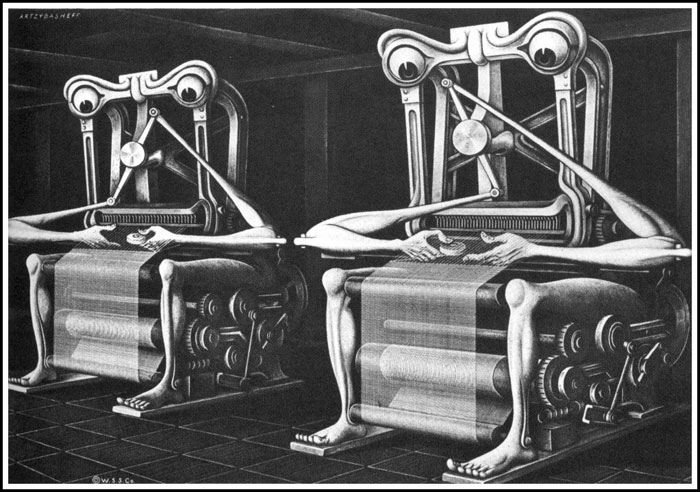
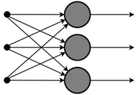
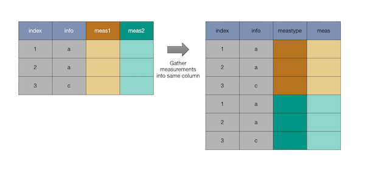
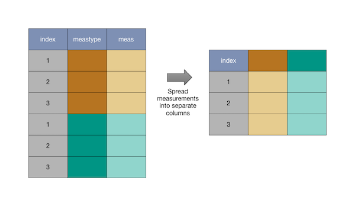

Coordinatized Data: A Fluid Data Specification
================
John Mount and Nina Zumel
March 29, 2017

Introduction
------------

It has been our experience when teaching the data wrangling part of data science that students often have difficulty understanding the conversion to and from row-oriented and column-oriented data formats (what is commonly called pivoting and un-pivoting).



[Boris Artzybasheff illustration](http://www.darkroastedblend.com/2014/01/machines-alive-whimsical-art-of-boris.html)

Real trust and understanding of this concept doesn't fully form until one realizes that rows and columns are *inessential* implementation details when *reasoning* about your data. Many *algorithms* are sensitive to how data is arranged in rows and columns, so there is a need to convert between representations. However, confusing representation with semantics slows down understanding.

In this article we will try to separate representation from semantics. We will advocate for thinking in terms of *coordinatized data*, and demonstrate advanced data wrangling in [`R`](https://cran.r-project.org).

Example
-------

Consider four data scientists who perform the same set of modeling tasks, but happen to record the data differently.

In each case the data scientist was asked to test two decision tree regression models (*a* and *b*) on two test-sets (*x* and *y*) and record both the model quality on the test sets under two different metrics ([`AUC`](https://en.wikipedia.org/wiki/Receiver_operating_characteristic#Area_under_the_curve) and [`pseudo R-squared`](http://www.win-vector.com/blog/2011/09/the-simpler-derivation-of-logistic-regression/)). The two models differ in tree depth (in this case model *a* has depth 5, and model *b* has depth 3), which is also to be recorded.

#### Data Scientist 1



Data scientist 1 is an experienced modeler, and records their data as follows:

``` r
library("tibble")
d1 <- tribble(
  ~model, ~depth, ~testset, ~AUC, ~pR2,
  'a',    5,      'x',      0.4,  0.2,
  'a',    5,      'y',      0.6,  0.3,
  'b',    3,      'x',      0.5,  0.25,
  'b',    3,      'y',      0.5,  0.25
)
print(d1)
```

    ## # A tibble: 4 x 5
    ##   model depth testset   AUC   pR2
    ##   <chr> <dbl>   <chr> <dbl> <dbl>
    ## 1     a     5       x   0.4  0.20
    ## 2     a     5       y   0.6  0.30
    ## 3     b     3       x   0.5  0.25
    ## 4     b     3       y   0.5  0.25

Data Scientist 1 uses what is called a *denormalized form* (we use this term out of respect for the priority of [Codd's relational model theory](https://en.wikipedia.org/wiki/Relational_model)). In this form each row contains all of the facts we want ready to go. If we were thinking about "column roles" (a concept we touched on briefly in Section A.3.5 "How to Think in SQL" of [*Practical Data Science with R*, Zumel, Mount; Manning 2014](http://www.practicaldatascience.com/)), then we would say the columns `model` and `testset` are *key columns* (together they form a *composite key* that uniquely identifies rows), the `depth` column is derived (it is a function of `model`), and `AUC` and `pR2` are *payload columns* (they contain data).

Denormalized forms are the most ready for tasks that reason across columns, such as training or evaluating machine learning models.

#### Data Scientist 2


Data Scientist 2 has data warehousing experience and records their data in a [normal form](https://en.wikipedia.org/wiki/Database_normalization#Normal_forms):

``` r
models2 <- tribble(
  ~model, ~depth,
  'a',    5,
  'b',    3
)

d2 <- tribble(
  ~model, ~testset, ~AUC, ~pR2,
  'a',   'x',      0.4,  0.2,
  'a',   'y',      0.6,  0.3,
  'b',   'x',      0.5,  0.25,
  'b',   'y',      0.5,  0.25
)

print(models2)
```

    ## # A tibble: 2 x 2
    ##   model depth
    ##   <chr> <dbl>
    ## 1     a     5
    ## 2     b     3

``` r
print(d2)
```

    ## # A tibble: 4 x 4
    ##   model testset   AUC   pR2
    ##   <chr>   <chr> <dbl> <dbl>
    ## 1     a       x   0.4  0.20
    ## 2     a       y   0.6  0.30
    ## 3     b       x   0.5  0.25
    ## 4     b       y   0.5  0.25

The idea is: since `depth` is a function of the model name, it should not be recorded as a column unless needed. In a normal form such as above, every item of data is written only one place. This means that we cannot have inconsistencies such as accidentally entering two different depths for a given model. In this example all our columns are either key or payload.

Data Scientist 2 is not concerned about any difficulty that might arise by this format as they know they can convert to Data Scientist 1's format by using a `join` command:

``` r
suppressPackageStartupMessages(library("dplyr"))

d1_2 <- left_join(d2, models2, by='model') %>%
  select(model, depth, testset, AUC, pR2) %>%
  arrange(model, testset)
print(d1_2)
```

    ## # A tibble: 4 x 5
    ##   model depth testset   AUC   pR2
    ##   <chr> <dbl>   <chr> <dbl> <dbl>
    ## 1     a     5       x   0.4  0.20
    ## 2     a     5       y   0.6  0.30
    ## 3     b     3       x   0.5  0.25
    ## 4     b     3       y   0.5  0.25

``` r
all.equal(d1, d1_2)
```

    ## [1] TRUE

[Relational](https://en.wikipedia.org/wiki/Relational_algebra) data theory (the science of joins) is the basis of Structured Query Language (`SQL`) and a topic any data scientist *must* master.

#### Data Scientist 3


Data Scientist 3 has a lot of field experience, and prefers an [entity/attribute/value](https://en.wikipedia.org/wiki/Entity–attribute–value_model) notation. They log each measurement as a separate row:

``` r
d3 <- tribble(
  ~model, ~depth, ~testset, ~measurement, ~value,
  'a',    5,      'x',      'AUC',        0.4,
  'a',    5,      'x',      'pR2',        0.2,
  'a',    5,      'y',      'AUC',        0.6,
  'a',    5,      'y',      'pR2',        0.3,
  'b',    3,      'x',      'AUC',        0.5,
  'b',    3,      'x',      'pR2',        0.25,
  'b',    3,      'y',      'AUC',        0.5,
  'b',    3,      'y',      'pR2',        0.25
)
print(d3)
```

    ## # A tibble: 8 x 5
    ##   model depth testset measurement value
    ##   <chr> <dbl>   <chr>       <chr> <dbl>
    ## 1     a     5       x         AUC  0.40
    ## 2     a     5       x         pR2  0.20
    ## 3     a     5       y         AUC  0.60
    ## 4     a     5       y         pR2  0.30
    ## 5     b     3       x         AUC  0.50
    ## 6     b     3       x         pR2  0.25
    ## 7     b     3       y         AUC  0.50
    ## 8     b     3       y         pR2  0.25

In this form `model`, `testset`, and `measurement` are key columns. `depth` is still running around as a derived column and the new `value` column holds the measurements (which could in principle have different types in different rows!).

Data Scientist 3 is not worried about their form causing problems as they know how to convert into Data Scientist 1's format with an `R` command:

``` r
library("tidyr")

d1_3 <- d3 %>%
  spread('measurement', 'value') %>%
  select(model, depth, testset, AUC, pR2) %>%  # to guarantee column order
  arrange(model, testset)  # to guarantee row order
print(d1_3)
```

    ## # A tibble: 4 x 5
    ##   model depth testset   AUC   pR2
    ##   <chr> <dbl>   <chr> <dbl> <dbl>
    ## 1     a     5       x   0.4  0.20
    ## 2     a     5       y   0.6  0.30
    ## 3     b     3       x   0.5  0.25
    ## 4     b     3       y   0.5  0.25

``` r
all.equal(d1, d1_3)
```

    ## [1] TRUE

You can read a bit on `spread()` [here](http://r4ds.had.co.nz/tidy-data.html#spreading-and-gathering).

We will use the term `pivotValuesToColumns()` for this operation later. The `spread()` will be replaced with the following.

``` r
  pivotValuesToColumns(data = d3,
                      columnToTakeKeysFrom = 'measurement',
                      columnToTakeValuesFrom = 'value',
                      rowKeyColumns = c('model', 'testset'))
```

The above operation is a bit exotic and it (and its inverse) already go under number of different names:

-   `pivot` / un-pivot (Microsoft Excel)
-   `pivot` / anti-pivot (databases)
-   `crosstab` / un-crosstab (databases)
-   `unstack` / `stack` (`R`)
-   `cast` / `melt` (`reshape`, `reshape2`)
-   `spread` / `gather` (`tidyr`)
-   "widen" / "narrow" (colloquial)
-   `pivotValuesToColumns()` and `unpivotValuesToRows()` (this writeup, basic "coordinatized data")
-   `moveValuesToColums*()` and `moveValuesToRow*()` (the more genaral "fluid data" operators)

And we are certainly neglecting other namings of the concept. We find none of these particularly evocative (though [cheatsheets help](https://www.rstudio.com/wp-content/uploads/2015/02/data-wrangling-cheatsheet.pdf)), so one purpose of this note will be to teach these concepts in terms of the deliberately verbose ad-hoc terms: `pivotValuesToColumns()` and `unpivotValuesToRows()`.

Note: often the data re-arrangement operation is only exposed as part of a larger aggregating or tabulating operation. Also `pivotValuesToColumns()` is considered the harder transform direction (as it has to group rows to work), so it is often supplied in packages, whereas analysts often use ad-hoc methods for the simpler `unpivotValuesToRows()` operation (to be defined next).

#### Data Scientist 4


Data Scientist 4 picks a form that makes models unique keys, and records the results as:

``` r
d4 <- tribble(
  ~model, ~depth, ~x_AUC, ~x_pR2, ~y_AUC, ~y_pR2,
  'a',    5,      0.4,    0.2,   0.6,    0.3,
  'b',    3,      0.5,    0.25,  0.5,    0.25
)

print(d4)
```

    ## # A tibble: 2 x 6
    ##   model depth x_AUC x_pR2 y_AUC y_pR2
    ##   <chr> <dbl> <dbl> <dbl> <dbl> <dbl>
    ## 1     a     5   0.4  0.20   0.6  0.30
    ## 2     b     3   0.5  0.25   0.5  0.25

This is not a problem as it is possible to convert to Data Scientist 3's format.

``` r
d3_4 <- d4 %>%
  gather('meas', 'value', x_AUC, y_AUC, x_pR2, y_pR2) %>%
  separate(meas, c('testset', 'measurement')) %>%
  select(model, depth, testset, measurement, value) %>%
  arrange(model, testset, measurement)
print(d3_4)
```

    ## # A tibble: 8 x 5
    ##   model depth testset measurement value
    ##   <chr> <dbl>   <chr>       <chr> <dbl>
    ## 1     a     5       x         AUC  0.40
    ## 2     a     5       x         pR2  0.20
    ## 3     a     5       y         AUC  0.60
    ## 4     a     5       y         pR2  0.30
    ## 5     b     3       x         AUC  0.50
    ## 6     b     3       x         pR2  0.25
    ## 7     b     3       y         AUC  0.50
    ## 8     b     3       y         pR2  0.25

``` r
all.equal(d3, d3_4)
```

    ## [1] TRUE

We will replace the `gather` operation with `unpivotValuesToRows()` and the call will look like the following.

``` r
 unpivotValuesToRows(data = d4,
                  nameForNewKeyColumn = 'meas', 
                  nameForNewValueColumn = 'value', 
                  columnsToTakeFrom = c('x_AUC', 'y_AUC', 'x_pR2', 'y_pR2'))
```

`unpivotValuesToRows()` is (under some restrictions) an inverse of `pivotValuesToColumns()`.


We find the more verbose naming (and calling interface) more intuitive. So we encourage you to think directly in terms of `unpivotValuesToRows()` as moving values to different rows (in the same column), and `moveValuesToColums()` as moving values to different columns (in the same row). It will usually be apparent from your problem which of these operations you want to use.

The Theory of Coordinatized Data
--------------------------------

When you are working with transformations you look for invariants to keep your bearings. All of the above data share an invariant property we call being *coordinatized* data. In this case the invariant is so strong that one can think of all of the above examples as being equivalent, and the row/column transformations as merely changes of frame of reference.

Let's define *coordinatized data* by working with our examples. In all the above examples a value carrying (or payload) cell or entry can be uniquely named as follows:

      c(Table=tableName, (KeyColumn=KeyValue)*, ValueColumn=ValueColumnName)

The above notations are the coordinates of the data item (hence "coordinatized data").

For instance: the `AUC` of 0.6 is in a cell that is named as follows for each of our scientists as:

-   Data Scientist 1: `c(Table='d1', model='a', testset='y', ValueColumn='AUC')`
-   Data Scientist 2: `c(Table='d2', model='a', testset='y', ValueColumn='AUC')`
-   Data Scientist 3: `c(Table='d3', model='a', testset='y', measurement='AUC', ValueColumn='value')`
-   Data Scientist 4: `c(Table='d4', model='a', ValueColumn= paste('y', 'AUC', sep= '_'))`

From our point of view these keys all name the same data item. We deliberately do not call one form tidy or another form un-tidy (which can be taken as a needlessly pejorative judgement), each has advantages depending on the application.

The fact that we are interpreting one position as a table name and another as a column name is just convention (one can try to take these key-based representations further, as in [RDF triples](https://en.wikipedia.org/wiki/Semantic_triple), but this usually leads to awkward data representations). We can even write `R` code that uses these keys on all our scientists' data without performing any reformatting:

``` r
# take a map from names to scalar conditions and return a value.
# inefficient method; notional only
lookup <- function(key) {
  table <- get(key[['Table']])
  col <- key[['ValueColumn']]
  conditions <- setdiff(names(key), 
                        c('Table', 'ValueColumn'))
  for(ci in conditions) {
    table <- table[table[[ci]]==key[[ci]], ,
                   drop= FALSE]
  }
  table[[col]][[1]]
}

k1 <- c(Table='d1', model='a', testset='y', 
        ValueColumn='AUC')
k2 <- c(Table='d2', model='a', testset='y', 
        ValueColumn='AUC')
k3 <- c(Table='d3', model='a', testset='y', 
        measurement='AUC', ValueColumn='value')
k4 = c(Table='d4', model='a', 
       ValueColumn= paste('y', 'AUC', sep= '_'))

print(lookup(k1))
```

    ## [1] 0.6

``` r
print(lookup(k2))
```

    ## [1] 0.6

``` r
print(lookup(k3))
```

    ## [1] 0.6

``` r
print(lookup(k4))
```

    ## [1] 0.6

The `lookup()` procedure was able to treat all these keys and key positions uniformly. This illustrates that what is in tables versus what is in rows versus what is in columns is just an implementation detail. Once we understand that all of these data scientists recorded the same data we should not be surprised we can convert between representations.

The thing to remember: coordinatized data is in cells, and every cell has unique coordinates. We are going to use this invariant as our enforced [precondition](https://en.wikipedia.org/wiki/Precondition) before any data transform, which will guarantee our data meets this invariant as a postcondition. I.e., if we restrict ourselves to coordinatized data and exclude wild data, the operations `pivotValuesToColumns()` and `unpivotValuesToRows()` become well-behaved and much easier to comprehend. In particular, *they are invertible*. (In math terms, the operators `pivotValuesToColumns()` and `unpivotValuesToRows()` form a [groupoid](https://en.wikipedia.org/wiki/Groupoid) acting on coordinatized data.)


[The 15 puzzle: another groupoid](http://www.neverendingbooks.org/the-15-puzzle-groupoid-1)

By "wild" data we mean data where cells don't have unique `lookup()` addresses. This often happens in data that has repeated measurements. Wild data is simply tamed by adding additional keying columns (such as an arbitrary experiment repetition number). Hygienic data collection practice nearly always produces coordinatized data, or at least data that is easy to coordinatize. Our position is that your data should always be coordinatized; if it's not, you shouldn't be working with it yet.

Rows and Columns
----------------

Many students are initially surprised that row/column conversions are considered "easy." Thus, it is worth taking a little time to review moving data between rows and columns.

### Moving From Columns to Rows ("Thinifying data")



Moving data from columns to rows (i.e., from Scientist 1 to Scientist 3) is easy to demonstrate and explain.

The only thing hard about this operation is remembering the name of the operation ("`gather()`") and the arguments. We can remove this inessential difficulty by bringing in a new notation (on top of a very powerful theory and implementation):

``` r
library("cdata")
```

    ## Loading required package: wrapr

In this notation moving from Data Scientist 1's records to Data Scientist 3's looks like the following.

``` r
d3from1 <- unpivotValuesToRows(data=d1,
                            nameForNewKeyColumn= 'measurement',
                            nameForNewValueColumn= 'value',
                            columnsToTakeFrom = c('AUC', 'pR2')) %>%
  select(model, depth, testset, measurement, value) %>%
  arrange(model, testset, measurement)
print(d3from1)
```

    ##   model depth testset measurement value
    ## 1     a     5       x         AUC  0.40
    ## 2     a     5       x         pR2  0.20
    ## 3     a     5       y         AUC  0.60
    ## 4     a     5       y         pR2  0.30
    ## 5     b     3       x         AUC  0.50
    ## 6     b     3       x         pR2  0.25
    ## 7     b     3       y         AUC  0.50
    ## 8     b     3       y         pR2  0.25

``` r
all.equal(d3, d3from1)
```

    ## [1] TRUE

In a `unpivotValuesToRows()` operation each row of the data frame is torn up and used to make many rows. Each of the columns we specify that we want measurements from gives us a new row from each of the original data rows.

The pattern is more obvious if we process any rows of `d1` independently:

``` r
row <- d1[3,]
print(row)
```

    ## # A tibble: 1 x 5
    ##   model depth testset   AUC   pR2
    ##   <chr> <dbl>   <chr> <dbl> <dbl>
    ## 1     b     3       x   0.5  0.25

``` r
unpivotValuesToRows(data=row,
                 nameForNewKeyColumn= 'measurement',
                 nameForNewValueColumn= 'value',
                 columnsToTakeFrom = c('AUC', 'pR2')) %>%
  select(model, depth, testset, measurement, value) %>%
  arrange(model, testset, measurement)
```

    ##   model depth testset measurement value
    ## 1     b     3       x         AUC  0.50
    ## 2     b     3       x         pR2  0.25

### Moving From Rows to Columns ("Widening data")

Moving data from rows to columns (i.e., from Scientist 3 to Scientist 1) is a bit harder to explain, and usually not explained well.

In moving from rows to columns we group a set of rows that go together (match on keys) and then combine them into one row by adding additional columns.



Note: to move data from rows to columns *we must know which set of rows go together*. That means some set of columns is working as keys, even though this is not emphasized in the `spread()` calling interface or explanations. For invertible data transforms, we want a set of columns (`rowKeyColumns`) that define a composite key that uniquely identifies each row of the result. For this to be true, the `rowKeyColumns` plus the column we are taking value keys from must uniquely identify each row of the input.

To make things easier to understand and remember, we introduce another function: `pivotValuesToColumns()`.

This lets us rework the example of moving from Data Scientist 3's format to Data Scientist 1's:

``` r
d1from3 <- pivotValuesToColumns(data= d3,
                    columnToTakeKeysFrom= 'measurement',
                    columnToTakeValuesFrom= 'value',
                    rowKeyColumns= c('model', 'testset')) %>%
  select(model, depth, testset, AUC, pR2) %>%
  arrange(model, testset)
print(d1from3)
```

    ##   model depth testset AUC  pR2
    ## 1     a     5       x 0.4 0.20
    ## 2     a     5       y 0.6 0.30
    ## 3     b     3       x 0.5 0.25
    ## 4     b     3       y 0.5 0.25

``` r
all.equal(d1, d1from3)
```

    ## [1] TRUE

If the structure of our data doesn't match our expected keying we can have problems. We emphasize that these problems arise from trying to work with non-coordinatized data, and not from the transforms themselves.

##### Too little keying

If our keys don't contain enough information to match rows together we can have a problem. Suppose our `testset` record was damaged or not present and look how a direct call to `spread` works:

``` r
d3damaged <- d3
d3damaged$testset <- 'z'
print(d3damaged)
```

    ## # A tibble: 8 x 5
    ##   model depth testset measurement value
    ##   <chr> <dbl>   <chr>       <chr> <dbl>
    ## 1     a     5       z         AUC  0.40
    ## 2     a     5       z         pR2  0.20
    ## 3     a     5       z         AUC  0.60
    ## 4     a     5       z         pR2  0.30
    ## 5     b     3       z         AUC  0.50
    ## 6     b     3       z         pR2  0.25
    ## 7     b     3       z         AUC  0.50
    ## 8     b     3       z         pR2  0.25

``` r
spread(d3damaged, 'measurement', 'value')
```

    ## Error: Duplicate identifiers for rows (1, 3), (5, 7), (2, 4), (6, 8)

This happens because the precondition is not met: the columns `(model, testset, measurement)` don't uniquely represent each row of the input. Catching the error is good, and we emphasize that in our function.

``` r
pivotValuesToColumns(data= d3damaged,
                    columnToTakeKeysFrom= 'measurement',
                    columnToTakeValuesFrom= 'value',
                    rowKeyColumns= c('model', 'testset'))
```

    ## Error in pivotValuesToColumns(data = d3damaged, columnToTakeKeysFrom = "measurement", : 
    ##  moveValeusToColumns: specified
    ##  rowKeyColumns plus columnToTakeKeysFrom
    ##  isn't unique across rows

The above issue is often fixed by adding additional columns (such as measurement number or time of measurement).

##### Too much keying

Columns can also contain too fine a key structure. For example, suppose our data was damaged and `depth` is no longer a function of the model id, but contains extra detail. In this case a direct call to `spread` produces a way too large result because the extra detail prevents it from matching rows.

``` r
d3damaged <- d3
d3damaged$depth <- seq_len(nrow(d3damaged))
print(d3damaged)
```

    ## # A tibble: 8 x 5
    ##   model depth testset measurement value
    ##   <chr> <int>   <chr>       <chr> <dbl>
    ## 1     a     1       x         AUC  0.40
    ## 2     a     2       x         pR2  0.20
    ## 3     a     3       y         AUC  0.60
    ## 4     a     4       y         pR2  0.30
    ## 5     b     5       x         AUC  0.50
    ## 6     b     6       x         pR2  0.25
    ## 7     b     7       y         AUC  0.50
    ## 8     b     8       y         pR2  0.25

``` r
spread(d3damaged, 'measurement', 'value') 
```

    ## # A tibble: 8 x 5
    ##   model depth testset   AUC   pR2
    ## * <chr> <int>   <chr> <dbl> <dbl>
    ## 1     a     1       x   0.4    NA
    ## 2     a     2       x    NA  0.20
    ## 3     a     3       y   0.6    NA
    ## 4     a     4       y    NA  0.30
    ## 5     b     5       x   0.5    NA
    ## 6     b     6       x    NA  0.25
    ## 7     b     7       y   0.5    NA
    ## 8     b     8       y    NA  0.25

The frame `d3damaged` does not match the user's probable intent: that the columns `(model, testset)` should uniquely specify row groups, or in other words, they should uniquely identify each row of the result.

In the above case we feel it is good to allow the user to declare intent (hence the extra `rowKeyColumns` argument) and throw an exception if the data is not structured how the user expects (instead of allowing this data to possibly ruin a longer analysis in some unnoticed manner).

``` r
pivotValuesToColumns(data= d3damaged,
                    columnToTakeKeysFrom= 'measurement',
                    columnToTakeValuesFrom= 'value',
                    rowKeyColumns= c('model', 'testset'))
```

    ## Error in pivotValuesToColumns(data = d3damaged, columnToTakeKeysFrom = "measurement", : 
    ##  some columns not in
    ##  c(rowKeyColumns, columnToTakeKeysFrom, columnToTakeValuesFrom)
    ##  are splitting up row groups

The above issue is usually fixed by one of two solutions (which one is appropriate depends on the situation):

1.  Stricter control (via `dplyr::select()`) of which columns are in the analysis. In our example, we would `select` all the columns of `d3damaged` except `depth`.
2.  Aggregating or summing out the problematic columns. For example if the problematic column in our example were `runtime`, which could legitimately vary for the same model and dataset, we could use `dplyr::group_by/summarize` to create a data frame with columns `(model, testset, mean_runtime, measurement, value)`, so that `(model, testset)` does uniquely specify row groups.

Conclusion
----------

The concept to remember is: organize your records so data cells have unique consistent abstract coordinates. For coordinatized data the actual arrangement of data into tables, rows, and columns is an implementation detail or optimization that does not significantly change what the data means.

For coordinatized data different layouts of rows and columns are demonstrably equivalent. We document and maintain this equivalence by asking the analyst to describe their presumed keying structure to our methods, which then use this documentation to infer intent and check preconditions on the transforms.

It pays to think fluidly in terms of coordinatized data and delay any format conversions until you actually need them. You will eventually need transforms as most data processing steps have a preferred format. For example, machine learning training usually requires a denormalized form.

We feel the methods [`unpivotValuesToRows()`](https://winvector.github.io/cdata/reference/unpivotValuesToRows.html) and [`pivotValuesToColumns()`](https://winvector.github.io/cdata/reference/pivotValuesToColumns.html) are easier to learn and remember than abstract terms such as "stack/unstack", "melt/cast", or "gather/spread" and thus are a good way to teach. Perhaps they are even a good way to document (and confirm) your intent in your own projects. These terms also anticipate the more general table controlled operators [`moveValuesToRows()`](https://winvector.github.io/cdata/reference/moveValuesToRowsN.html) and [`moveValuesToColumns()`](https://winvector.github.io/cdata/reference/moveValuesToColumnsN.html).
