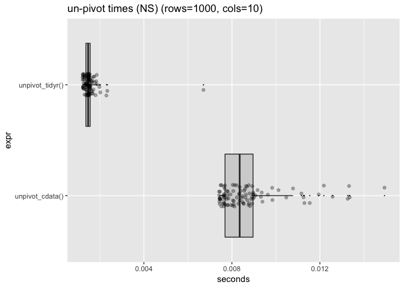
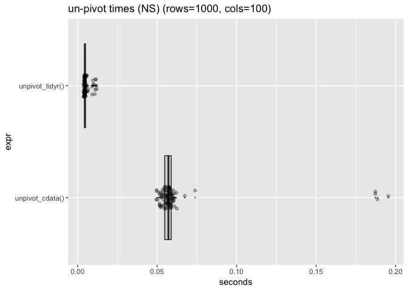
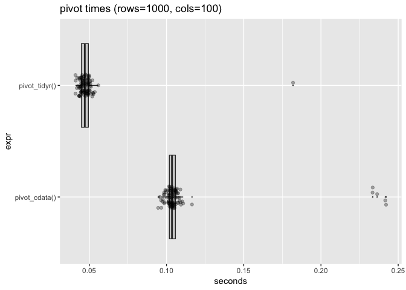
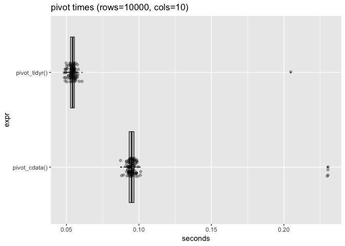
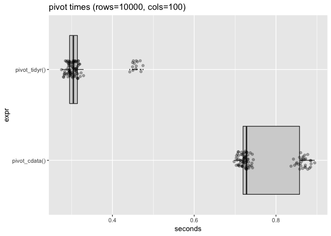

perf
================
Win-Vector LLC
9/1/2018

``` r
library("microbenchmark")
library("ggplot2")
library("tidyr")
library("cdata")
```

``` r
set.seed(3525)
mkData <- function(nrow, ncol) {
  dWide <- data.frame(id = seq_len(nrow))
  for(ci in seq_len(ncol)) {
    cn <- paste("col", ci, sep = "_")
    dWide[[cn]] <- runif(nrow)
  }
  dWide
}

for(nrow in c(1000, 10000)) {
  for(ncol in c(10, 100)) {
    print("***************")
    print(paste("nrow", nrow, "ncol", ncol))
    dWide <- mkData(nrow, ncol)
    # unpivot in cdata notation
    # actually rowrecs_to_blocks() is the preferend notation 
    # and unpivot_to_blocks() is a convenience
    dTall_cdata <- unpivot_to_blocks(dWide, 
                                     nameForNewKeyColumn = "col_key",
                                     nameForNewValueColumn = "col_val",
                                     columnsToTakeFrom <- setdiff(colnames(dWide), "id"))
    dTall_cdata <- dTall_cdata[order(dTall_cdata$id, dTall_cdata$col_key), , drop = FALSE]
    rownames(dTall_cdata) <- NULL
    dTall <- dTall_cdata
    
    # unpivot in tidyr notation
    dTall_tidyr <- gather(dWide, key = "col_key", value= "col_val", -id)
    dTall_tidyr <- dTall_tidyr[order(dTall_tidyr$id, dTall_tidyr$col_key), , drop = FALSE]
    rownames(dTall_tidyr) <- NULL
    
    # check
    testthat::expect_equal(dTall_cdata, dTall_tidyr)
    
    # time
    unpivot_cdata <- function() {
      nrow(unpivot_to_blocks(dWide, 
                             nameForNewKeyColumn = "col_key",
                             nameForNewValueColumn = "col_val",
                             columnsToTakeFrom <- setdiff(colnames(dWide), "id")))
    }
    unpivot_tidyr <- function() {
      nrow(gather(dWide, key = "col_key", value= "col_val", -id))
    }
    
    
    t_unpivot <- microbenchmark(unpivot_cdata(), unpivot_tidyr())
    #print(t_unpivot)
    #print(autoplot(t_unpivot))
    t_unpivot$seconds <- t_unpivot$time/1e+9
    print(WVPlots::ScatterBoxPlotH(t_unpivot, "seconds", "expr",
                                   paste0("un-pivot times (NS) (rows=",
                                          nrow, 
                                          ", cols=",
                                          ncol,
                                          ")")))
    
    # pivot cdata notation
    # actually blocks_to_rowrecs() is the preferend notation 
    # and pivot_to_rowrecs() is a convenience
    res_cdata <- pivot_to_rowrecs(dTall, 
                                  columnToTakeKeysFrom = "col_key",
                                  columnToTakeValuesFrom = "col_val",
                                  rowKeyColumns = "id")
    res_cdata <- res_cdata[order(res_cdata$id), , drop = FALSE]
    res_cdata <- res_cdata[, colnames(dWide), drop = FALSE]
    rownames(res_cdata) <- NULL
    testthat::expect_equal(dWide, res_cdata)
    
    # pivot tidyr notation
    res_tidyr <- spread(dTall, "col_key", -id)
    res_tidyr <- res_tidyr[order(res_tidyr$id), , drop = FALSE]
    res_tidyr <- res_tidyr[, colnames(dWide), drop = FALSE]
    rownames(res_tidyr) <- NULL
    testthat::expect_equal(dWide, res_tidyr)
    
    # time
    pivot_cdata <- function() {
      nrow(pivot_to_rowrecs(dTall, 
                            columnToTakeKeysFrom = "col_key",
                            columnToTakeValuesFrom = "col_val",
                            rowKeyColumns = "id"))
    }
    pivot_tidyr <- function() {
      nrow(spread(dTall, "col_key", -id))
    }
    
    t_pivot <- microbenchmark(pivot_cdata(), pivot_tidyr())
    #print(t_pivot)
    #print(autoplot(t_pivot))
    t_pivot$seconds <- t_pivot$time/1e+9
    print(WVPlots::ScatterBoxPlotH(t_pivot,  "seconds", "expr", 
                                   paste0("pivot times (rows=",
                                          nrow, 
                                          ", cols=",
                                          ncol,
                                          ")")))
  }
}
```

    ## [1] "***************"
    ## [1] "nrow 1000 ncol 10"



    ## [1] "***************"
    ## [1] "nrow 1000 ncol 100"



    ## [1] "***************"
    ## [1] "nrow 10000 ncol 10"



    ## [1] "***************"
    ## [1] "nrow 10000 ncol 100"


