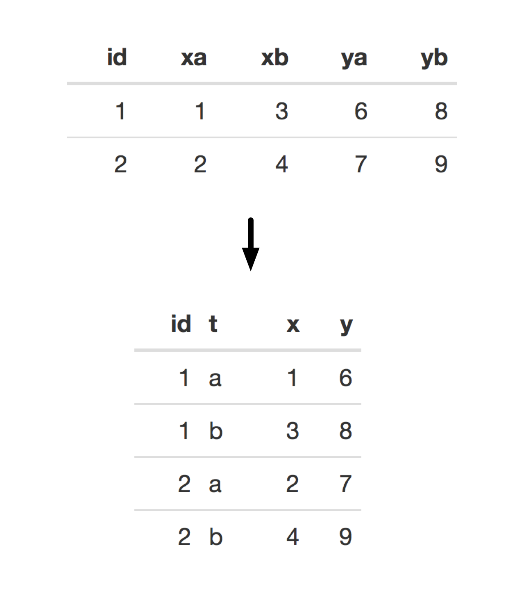
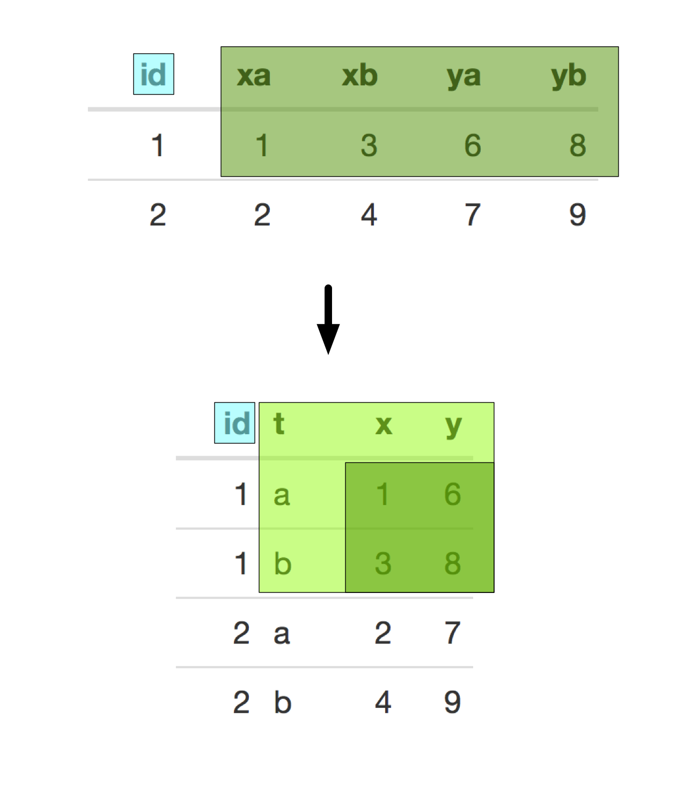
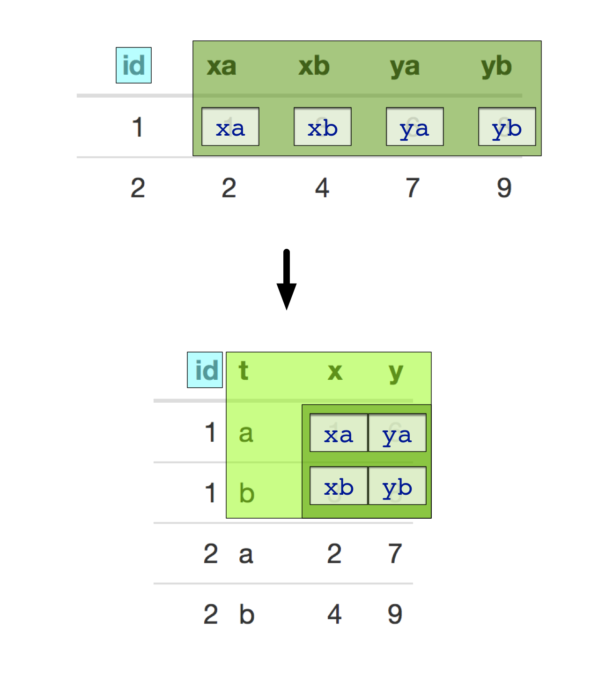

TweetExample
================

Here is an example how easy it is to use [`cdata`](https://github.com/WinVector/cdata) to re-layout your data.

Tim Morris recently [tweeted](https://twitter.com/WinVectorLLC/status/1117797504920080384) the following problem (corrected).

<code>
<pre>
Please will you take pity on me #rstats folks?
I only want to reshape two variables x & y from wide to long!

Starting with:
    d xa xb ya yb
    1  1  3  6  8
    2  2  4  7  9

How can I get to:
    id t x y
    1  a 1 6
    1  b 3 8
    2  a 2 7
    2  b 4 9
    
In Stata it's:
 . reshape long x y, i(id) j(t) string
In R, it's:
 . an hour of cursing followed by a desperate tweet 👆

Thanks for any help!

PS – I can make reshape() or gather() work when I have just x or just y.
</pre>
</code>

This is not to make fun of Tim Morris: the above *should* be easy. Using diagrams and slowing down the data transform into small steps makes the process very easy.

First: (and this is the important part) define our problem *using an example*. Tim Morris did this really well, but let's repeat it here. We want to realize the following data layout transform.



Second: identify the record ID and record structure in both the before and after examples.



Third: attach the [`cdata`](https://github.com/WinVector/cdata) package, and use `build_frame()` to type in the example "before" data.

``` r
library("cdata")

before <- build_frame(
  "id"  , "xa", "xb", "ya", "yb" |
    1   , 1   , 3   , 6   , 8    |
    2   , 2   , 4   , 7   , 9    )

knitr::kable(before)
```

|   id|   xa|   xb|   ya|   yb|
|----:|----:|----:|----:|----:|
|    1|    1|    3|    6|    8|
|    2|    2|    4|    7|    9|

Fourth: (this is the "hard" part) copy the column marked names from the before into the matching record positions in the after example.



Fifth: copy the annotated "after" record in as your layout transform control table.

``` r
ct <- qchar_frame(
  "t"  , "x" , "y" |
    "a", xa  , ya  |
    "b", xb  , yb  )

knitr::kable(ct)
```

| t   | x   | y   |
|:----|:----|:----|
| a   | xa  | ya  |
| b   | xb  | yb  |

In the above we are using a convention that concrete values are written in quotes, and symbols to be taken from the "before" data frame are written without quotes.

Now specify the many-record transform.

``` r
layout_spec <- rowrecs_to_blocks_spec(
  ct,
  recordKeys = "id")
```

The `layout_spec` completely encodes our intent. So we can look at it to double check what transform we have specified.

``` r
print(layout_spec)
```

    ## {
    ##  row_record <- wrapr::qchar_frame(
    ##    "id"  , "xa", "xb", "ya", "yb" |
    ##      .   , xa  , xb  , ya  , yb   )
    ##  row_keys <- c('id')
    ## 
    ##  # becomes
    ## 
    ##  block_record <- wrapr::qchar_frame(
    ##    "id"  , "t", "x", "y" |
    ##      .   , "a", xa , ya  |
    ##      .   , "b", xb , yb  )
    ##  block_keys <- c('id', 't')
    ## 
    ##  # args: c(checkNames = TRUE, checkKeys = TRUE, strict = FALSE)
    ## }

And we can now apply the layout transform to data.

``` r
after <- before %.>% layout_spec
# cdata 1.0.9 adds the non-piped function notation:
# layout_by(layout_spec, before)

knitr::kable(after)
```

|   id| t   |    x|    y|
|----:|:----|----:|----:|
|    1| a   |    1|    6|
|    1| b   |    3|    8|
|    2| a   |    2|    7|
|    2| b   |    4|    9|

A really fun extra: we can build an inverse layout specification to reverse the transform.

``` r
reverse_layout <- t(layout_spec) # invert the spec using t()

print(reverse_layout)
```

    ## {
    ##  block_record <- wrapr::qchar_frame(
    ##    "id"  , "t", "x", "y" |
    ##      .   , "a", xa , ya  |
    ##      .   , "b", xb , yb  )
    ##  block_keys <- c('id', 't')
    ## 
    ##  # becomes
    ## 
    ##  row_record <- wrapr::qchar_frame(
    ##    "id"  , "xa", "xb", "ya", "yb" |
    ##      .   , xa  , xb  , ya  , yb   )
    ##  row_keys <- c('id')
    ## 
    ##  # args: c(checkNames = TRUE, checkKeys = TRUE, strict = FALSE)
    ## }

``` r
after %.>% 
  reverse_layout %.>%
  knitr::kable(.)
```

|   id|   xa|   xb|   ya|   yb|
|----:|----:|----:|----:|----:|
|    1|    1|    3|    6|    8|
|    2|    2|    4|    7|    9|

And that is it, we have a re-usable `layout_spec` that can transform future data. We have a lot of tutorial on the method [here](https://winvector.github.io/cdata/), and the source code for this note can be found [here](https://github.com/WinVector/cdata/blob/master/extras/tw/TweetExample.Rmd).
