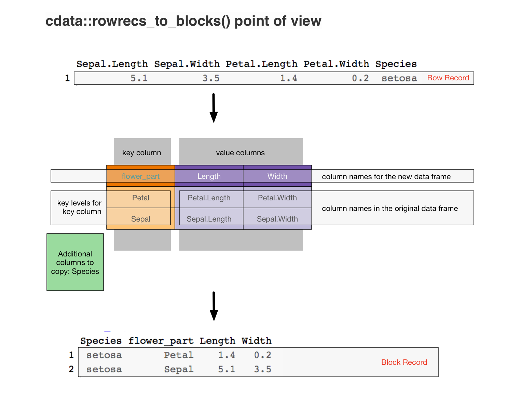
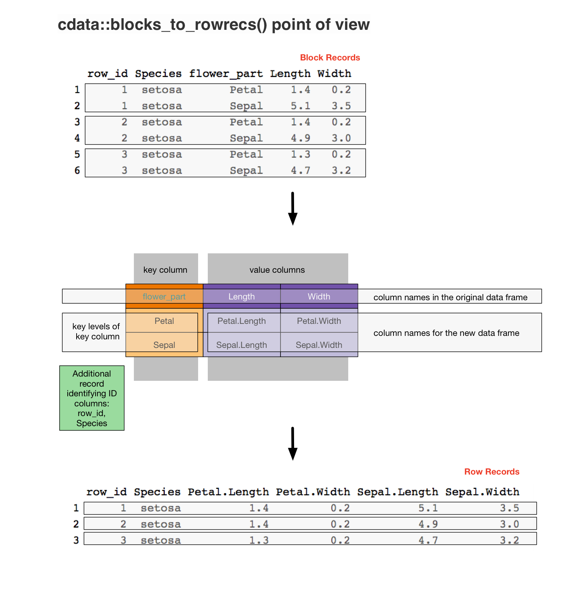

```{r setup, include = FALSE}
knitr::opts_chunk$set(
  collapse = TRUE,
  comment = "#>"
)
```

# Block Records and Row Records

The theory of [`cdata`](https://winvector.github.io/cdata/) data transforms is based on the principles:

  * data has coordinates 
  * data is naturally grouped into records.
  
The idea of data coordinates is related to [Codd's 2nd rule](https://en.wikipedia.org/wiki/Codd%27s_12_rules): 
  
> Each and every datum (atomic value) in a relational data base is guaranteed to be logically accessible by resorting to a combination of table name, primary key value and column name.

The coordinatized data concept is that the exact *current* data realization is incidental.  One can perform a data *change of basis* to get the data into the right format (where the physical layout of records is altered to match the desired logical layout of the data).

The idea of data records (and these records possibly being different than simple rows) is a staple of computer science: harking at least back to [record-oriented filesystems](https://en.wikipedia.org/wiki/Record-oriented_filesystem).

The core of the `cdata` package is to supply transforms between what we call "row records" (records that
happen to be implemented as a single row) and block records (records that span multiple rows).  These two
methods are:

  * `cdata::rowrecs_to_blocks()`
  * `cdata::blocks_to_rowrecs()`
  
All the other `cdata` functions are helpers allowing abbreviated notation in special cases (such as `unpivot_to_blocks()` `pivot_to_rowrecs()`) and adapters (allowing these operations to be performed directly in databases and large data systems such as `Apache Spark`).

The current favored idiomatic interfaces to `cdata` are:

  * [`pivot_to_rowrecs()`](https://winvector.github.io/cdata/reference/pivot_to_rowrecs.html), a convenience function for moving data from multi-row block records with one value per row to single row records.
  * [`unpivot_to_blocks()`](https://winvector.github.io/cdata/reference/unpivot_to_blocks.html), a convenience function for moving data from single-row records to possibly multi row block records with one row per value.
  * [`rowrecs_to_blocks_spec()`](https://winvector.github.io/cdata/reference/rowrecs_to_blocks_spec.html), for specifying how single row records relate to general multi-row (or block) records.
  * [`blocks_to_rowrecs_spec()`](https://winvector.github.io/cdata/reference/blocks_to_rowrecs_spec.html), for specifying how multi-row block records relate to single-row records.
  * [`layout_by()`](https://winvector.github.io/cdata/reference/layout_by.html) or the [wrapr dot arrow pipe](https://winvector.github.io/wrapr/reference/dot_arrow.html) for applying a layout to re-arrange data.
  * `t()` (transpose/adjoint) to invert or reverse layout specifications.
  * [`wrapr::qchar_frame()`](https://winvector.github.io/wrapr/reference/qchar_frame.html) a helper in specifying record control table layout specifications.
  * [`layout_specification()`](https://winvector.github.io/cdata/reference/layout_specification.html), for specifying transforms from multi-row records to other multi-row records.


Let's look at `cdata` with some specific data.

For our example let's take the task of re-organizing the `iris` data for a faceted plot, as
discussed [here](https://win-vector.com/2018/10/21/faceted-graphs-with-cdata-and-ggplot2/).

```{r}
library(cdata)

iris <- data.frame(iris)
iris$iris_id <- seq_len(nrow(iris))

head(iris, n=1)
```

To transform this data into a format ready for our `ggplot2` task we design (as [taught here](https://winvector.github.io/cdata/articles/design.html)) a "transform control table" that shows how to move from our row-oriented form into a block oriented form. Which in this case
looks like the following.



In `R` the transform table is specified as follows.

```{r}
controlTable <- wrapr::qchar_frame(
  "flower_part", "Length"      , "Width"     |
  "Petal"      , Petal.Length  , Petal.Width |
  "Sepal"      , Sepal.Length  , Sepal.Width )

layout <- rowrecs_to_blocks_spec(
  controlTable,
  recordKeys = c("iris_id", "Species"))

print(layout)
```

And then applying it converts rows from our `iris` data into ready to plot 2-row blocks.

```{r}
iris %.>%
  head(., n = 1) %.>%
  knitr::kable(.)

iris_aug <- iris %.>%
  head(., n = 1) %.>%
  layout

iris_aug %.>%
  knitr::kable(.)
```

To perform the reverse transform we use the same transform control table, but we think of it as specifying the reverse transform (from its own block form into a row).  The reverse can be specified using the `t()` transpose/adjoint method.




```{r}
# re-do the forward transform, this time
# with more records so we can see more
iris_aug <- iris %.>%
  head(., n = 3) %.>%
  layout

knitr::kable(iris_aug)

inv_layout <- t(layout)

print(inv_layout)

# demonstrate the reverse transform
iris_back <- iris_aug %.>%
  inv_layout

knitr::kable(iris_back)
```


`cdata` considers the row-record a universal intermediate form, and this has the advantage of being able to represent a different type per value (as each value per-record is in a different column)

This differs from `reshape2` where the `melt()` to "molten" (or thin [RDF-triple](https://en.wikipedia.org/wiki/Semantic_triple)-like) is used as the universal intermediate form that one then `dcast()`s into desired arrangements.

As we have said, a tutorial on *how* to design a `controlTable` can be found [here](https://winvector.github.io/cdata/articles/design.html) and [here](https://win-vector.com/2019/04/16/controlling-data-layout-with-cdata/).

Some additional (older) tutorials on `cdata` data transforms can are given below:

  * [The faceted plot example](https://win-vector.com/2018/10/21/faceted-graphs-with-cdata-and-ggplot2/)
  * [Fluid data reshaping with cdata](https://winvector.github.io/FluidData/FluidDataReshapingWithCdata.html)
  * [short free cdata screencast](https://youtu.be/4cYbP3kbc0k)
  * ["Coordinatized data" theory](https://winvector.github.io/FluidData/RowsAndColumns.html) 
  * [The "fluid data" methodology](https://winvector.github.io/FluidData/FluidData.html)
  * [another worked example](https://winvector.github.io/FluidData/DataWranglingAtScale.html).

# Appendix

The `cdata` operators can be related to Codd's relational operators as follows:

  * `rowrecs_to_blocks()` is a variation of a relational-join of the data with the control table.  This is why you get one row per pair of original data rows and control table rows.
  * `blocks_to_rowrecs()` is essentially an aggregation or relational-projection (actually even a coalesce) over a widened table.  This is why this operation decreases the number of rows.

