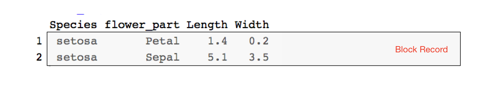
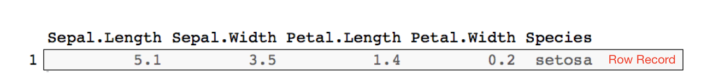
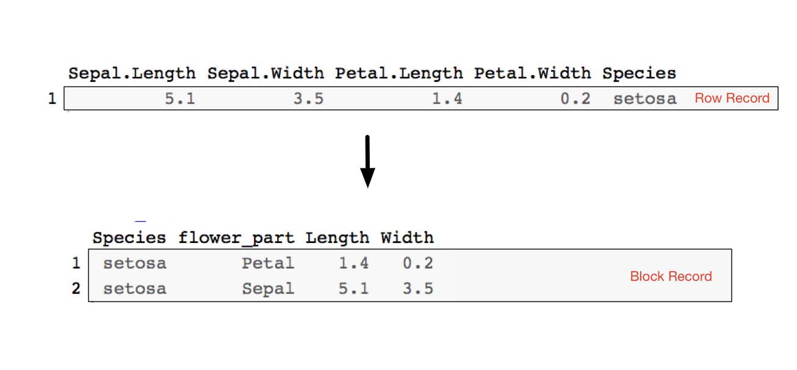
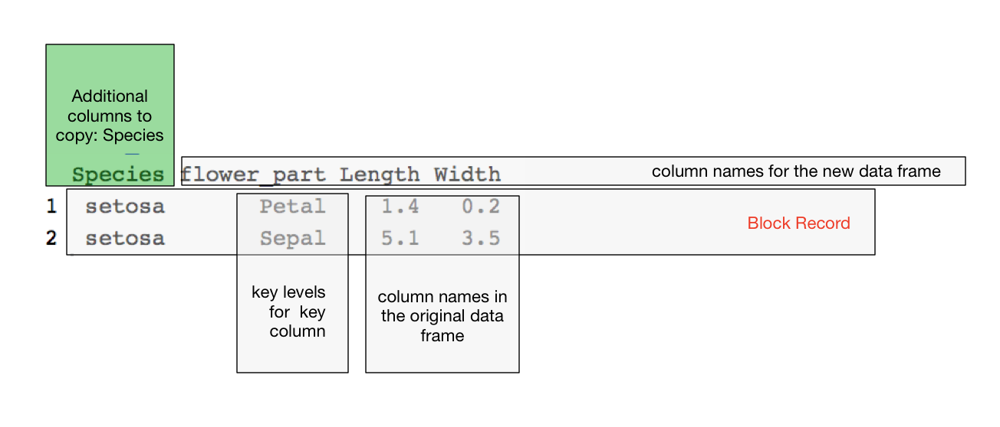
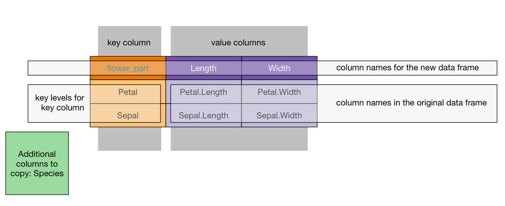

```{r setup, include = FALSE}
knitr::opts_chunk$set(
  collapse = TRUE,
  comment = "#>"
)
```

This note is about the design of data transforms using the [`cdata`](https://CRAN.R-project.org/package=cdata) package.  The `cdata` packages demonstrates the ["coordinatized data" theory](https://winvector.github.io/FluidData/RowsAndColumns.html) and includes an implementation of the ["fluid data" methodology](https://winvector.github.io/FluidData/FluidData.html) for general 
data re-shaping.

[`cdata`](https://CRAN.R-project.org/package=cdata) adheres to the so-called "Rule of Representation":

> Fold knowledge into data, so program logic can be stupid and robust.
>
> [*The Art of Unix Programming*, Erick S. Raymond, Addison-Wesley, 2003](http://www.catb.org/esr/writings/taoup/html/ch01s06.html#id2878263)

The design principle expressed by this rule is that it is much easier to reason about data than to try to reason about code, so using data to control your code is often a very good trade-off.

We showed in [this article](https://win-vector.com/2018/10/21/faceted-graphs-with-cdata-and-ggplot2/) how `cdata` takes a transform control table to specify how you want your data reshaped.
The question then becomes: how do you come up with the transform control table?

Let's discuss that using the example from the article: ["plotting the `iris` data faceted"](https://win-vector.com/2018/10/21/faceted-graphs-with-cdata-and-ggplot2/).

The goal is to produce the following graph with `ggplot2` 


In order to do this, one wants data that looks like the following:



Notice `Species` is in a column so we can use it to choose colors.
Also, `flower_part` is in a column so we can use it to facet.

However, `iris` data starts in the following format.



We call this form a *row record* because all the information about a single entity (a "record") lies in a single row.
When the information about an entity is distributed across several rows (in whatever shape), we call
that a *block record*. So the goal is to transform the row records in `iris` into the desired block records 
before plotting.



This new block record is partially keyed by the `flower_part` 
column, which tells us which piece of a record a row corresponds to
(the petal information, or the sepal information). We could also
add an `iris_id` as a per-record key; this we are not
adding, as we do not need it for our graphing task. However, adding a
per-record id makes the transform invertible, as is shown
[here](https://winvector.github.io/cdata/articles/blocksrecs.html).

There are a great number of ways to achieve the above transform. 
We are going to concentrate on the `cdata` methodology.  We want to move data from an "all of the record is in one row"
format to "the meaningful record unit is a block across several rows" format.
In `cdata` this means we want to perform a `rowrecs_to_blocks()` 
transform.  To do this we start by labeling the roles of different portion of
the block oriented data example.  In particular we identify:

 * Columns we want copied as additional row information (in this case `Species`, but often a per-record index or key).
 * The additional key that identifies parts of each multi-row record (in this case `flower_part`).
 * Levels we expect in the new record portion key column (`Petal` and `Sepal`).
 * New column names for the new `data.frame`. These will go where values are currently in the block record data.
 
 We show this labeling below.  



Notice we have marked the measurements `1.4, 0.2, 5.1, 3.5` as "column names", not values.  That is because
we must show which columns in the original data frame these values are coming from.

This annotated example record is the guide for building what we call the transform control table.  We build up the transform control table following these rules:

  * The key column is the first column of the control table.
  * The key levels we wish to track are values in the key column.
  * The column names of the control table are the new column names we will produce in our result.
  * The block of values seen in our example record are replaced by the names of the columns that these values were taken from in the original data.
  * Any other columns we want copied are specified in the `columnsToCopy` argument.



The `R` version of the above is specified as follows:

```{r}
# get a small sample of irises
iris <- head(iris, n = 3)
# add a record id to iris
iris$iris_id <- seq_len(nrow(iris))

knitr::kable(iris)
```

Specify the layout transform.

```{r}
library("cdata")

controlTable <- wrapr::qchar_frame(
  "flower_part", "Length"    , "Width"     |
  "Petal"      , Petal.Length, Petal.Width |
  "Sepal"      , Sepal.Length, Sepal.Width )

layout <- rowrecs_to_blocks_spec(
  controlTable,
  recordKeys = c("iris_id", "Species"))

print(layout)
```

And we can now perform the transform.

```{r}
iris %.>%
  knitr::kable(.)
  
iris_aug <- iris %.>% 
  layout

iris_aug %.>%
  knitr::kable(.)
```
  
  
The data is now ready to plot using `ggplot2` as was shown [here](https://win-vector.com/2018/10/21/faceted-graphs-with-cdata-and-ggplot2/).

Designing a `blocks_to_rowrecs` transform is just as easy, as the `controlTable` has the same
shape as the incoming record block (assuming the record partial key controlling column is the first column).  All 
one has to is get the reverse specification using `t()`.

For example:

```{r}
inv_layout <- t(layout)

print(inv_layout)

iris_aug %.>%
  inv_layout %.>%
  knitr::kable(.)
```

Notice in both cases that having examples of the before and after form of the transform is the guide to building the transform specification, that is, the transform control table. In practice: we *highly* recommend looking at your data, writing down what a 
single record on each side of the transform would look like, and then using that to fill out the control table on paper.  

The exercise of designing a control table really opens your eyes to how data is moving in such transforms and exposes a lot of structure of data transforms.  For example:

 * If the control table has two columns (one key column, one value column) then the operation could be implemented as a single `tidyr` `gather()` or `spread()`.
 * If the control table has `k` rows then the `rowrecs_to_blocks()` direction could be implemented as `k-1` `rbind()`s.


Some discussion of the nature of block records and row records in `cdata` can be found [here](https://winvector.github.io/cdata/articles/blocksrecs.html).

Some additional tutorials on `cdata` data transforms can are given below:

  * [The faceted plot example](https://win-vector.com/2018/10/21/faceted-graphs-with-cdata-and-ggplot2/)
  * [Fluid data reshaping with cdata](https://winvector.github.io/FluidData/FluidDataReshapingWithCdata.html)
  * [short free cdata screencast](https://youtu.be/4cYbP3kbc0k)
  * ["Coordinatized data" theory](https://winvector.github.io/FluidData/RowsAndColumns.html) 
  * [The "fluid data" methodology](https://winvector.github.io/FluidData/FluidData.html)
  * [another worked example](https://winvector.github.io/FluidData/DataWranglingAtScale.html).

