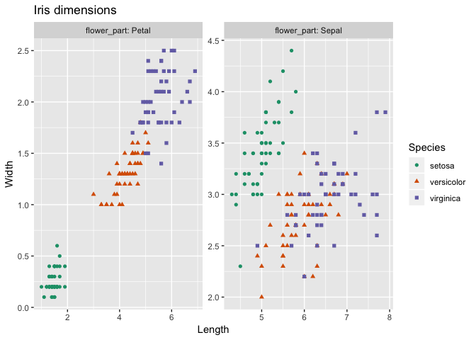

```{r setup, include = FALSE}
knitr::opts_chunk$set(
  collapse = TRUE,
  comment = "#>"
)
```


[`cdata`](https://CRAN.R-project.org/package=cdata) is a general data re-shaper that has the great virtue of adhering to the so-called "Rule of Representation":

> Fold knowledge into data, so program logic can be stupid and robust.
>
> [*The Art of Unix Programming*, Erick S. Raymond, Addison-Wesley
, 2003](http://www.catb.org/esr/writings/taoup/html/ch01s06.html#id2878263)

The point being: it is much easier to reason about data than to try to reason about code, so using data to control your code is often a very good trade-off.

The question is then: how do you come up with the transform control table needed to use `cdata` to solve your problem?

Let's discuss that with an example: ["plotting the `iris` data faceted"](http://www.win-vector.com/blog/2018/10/faceted-graphs-with-cdata-and-ggplot2/).

To produce the following graph with `ggplot2` 



One wants data that looks like the following:


Notice `Species` is in a column so we can use it to choose colors.
Also, `flower_part` is in a column so we can use it to facet.

However, `iris` data starts in the following format.


So we want to transform one to the other before plotting.


This new block record is partially keyed by the `flower_part` 
column (which tells us which piece of a record a row corresponds to)
and could be also per-record keyed by an `iris_id` (which we are not
adding, as we do not need it for our graphing task, adding the
per-record id makes the transform convertible and is shown 
[here](https://winvector.github.io/cdata/articles/blocksrecs.html)).

There are a great number of ways to achieve the above transform. 
We are going to concentrate on the `cdata` methodology.  
Notice we are moving data from an "all of the record is in one row"
to "the meaningful record unit is a block across several rows".
In `cdata` this means we want to perform a `rowrecs_to_blocks()` 
transform.  To do this we start by labeling the roles of different portion of
the block oriented data.  In particular we identify:

 * Columns we want copied as additional row information (in this case `Species`, but often a per-record index or key).
 * The additional key that identifies parts of each multi-row record (in this case `flower_part`).
 * Levels we expect in the new record portion key column.
 * New column names for the new `data.frame`, these are where values are in the block record data.
 * Re-label the block of values as "column names from the original data frame" as we need to specify which columns these example values are coming from.
 
We show this labeling below.  


Notice we have marked the measurements `1.4, 0.2, 5.1, 3.5` as "column names", not values.  That is because
we must show which columns these values are coming from.

This annotated example record is the guide for building what we call the transform control table.  We build up the transform control table following these rules:

  * The key column is the first column of the control table.
  * The key levels we wish to track are values in the key column.
  * The column names of the control table are the new column names we will produce in our result.
  * The block of values seen in our example record are replaced by a the column names these values were taken from in the original data.
  * Any other columns we want copied are specified in the `columnsToCopy` argument.


The `R` version of the above is specified as follows:

```{r}
(controlTable <- wrapr::qchar_frame(
  flower_part, Length      , Width       |
  Petal      , Petal.Length, Petal.Width |
  Sepal      , Sepal.Length, Sepal.Width ))

(columnsToCopy <- "Species")

```

And we can now perform the transform.

```{r}
library("cdata")

iris_aug <- rowrecs_to_blocks(
  iris,
  controlTable = controlTable,
  columnsToCopy = columnsToCopy) 

head(iris_aug)
```
  
  
The data is now ready to plot using `ggplot2` as was shown  [here](http://www.win-vector.com/blog/2018/10/faceted-graphs-with-cdata-and-ggplot2/).

Designing a `blocks_to_rowrecs` transform is even easier, as the `controlTable` has the same
shape as the incoming record block (assuming the record partial key controlling column is the first column).  All 
one has to do is replace the value in such an example record with the desired column names.

For example:

```{r}
# grab a record to use to build our control table 
ct <- iris_aug[1:2, c("flower_part", "Length", "Width")]
print(ct)

# replace values with desired column names
# as in this case the values are unique we can do
# this mechanically, normally we do this by hand
for(i in 1:nrow(ct)) {
  for(j in 2:ncol(ct)) {
    ct[i,j] <- colnames(iris)[which(iris[1,]==ct[i,j])]
  }
}

print(ct)
```


Though to actually move back from block records to row records we would need additional keys showing *which* rows together form a record (which we demonstrate [here](https://winvector.github.io/cdata/articles/blocksrecs.html)).

Notice in both cases having examples of the before and after form of the transform is the guide to building the transform specification (the transform control table). In practice: we *highly* recommend looking at your data, writing down what one record on each side of the transform would look like, and then using that to fill out the control table on paper.  

The exercise of examining designing a control table really opens your eye to how data is moving in such transforms and exposes a lot of structure of data transforms.  For example:

 * If the control table has two columns then the operation could be implemented as a single `tidyr` `gather()` or `spread()`.
 * If the control table has `k` rows then the `rowrecs_to_blocks()` direction could be implemented as `k-1` `rbind()`s.


Some discussion of the nature of block records and row records in `cdata` can be found [here](https://winvector.github.io/cdata/articles/blocksrecs.html).

Some additional tutorials on `cdata` data transforms can are given below:

  * [The faceted plot example](http://www.win-vector.com/blog/2018/10/faceted-graphs-with-cdata-and-ggplot2/)
  * [Fluid data reshaping with cdata](http://winvector.github.io/FluidData/FluidDataReshapingWithCdata.html)
  * [short free cdata screencast](https://youtu.be/4cYbP3kbc0k)
  * ["Coordinatized data" theory](http://winvector.github.io/FluidData/RowsAndColumns.html) 
  * [The "fluid data" methodology](http://winvector.github.io/FluidData/FluidData.html)
  * [another worked example](http://winvector.github.io/FluidData/DataWranglingAtScale.html).

